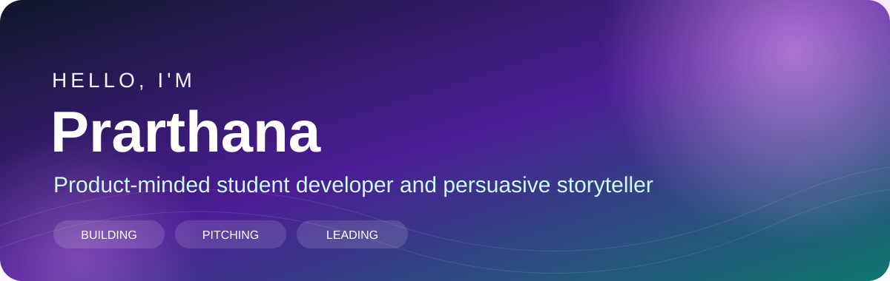
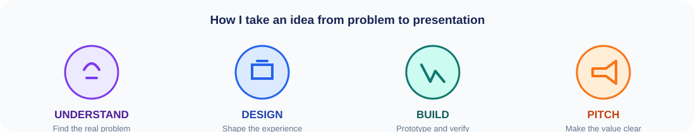

  

  <a href="https://calmcampus.onrender.com"><strong>Live project</strong></a>
  &nbsp;•&nbsp;
  <a href="https://github.com/praru-wq?tab=repositories"><strong>Repositories</strong></a>
  &nbsp;•&nbsp;
  <a href="mailto:sunflower225566@gmail.com"><strong>Email</strong></a>

  
  
  
  

## Hello

I'm **Prarthana Binu Kumar**, a final-year **Bachelor of Computer Applications student at Shree Devi College of Information Science**, with add-on study in **Artificial Intelligence, Cybersecurity, and Big Data**.

I enjoy the complete product journey: understanding a problem, designing a clear experience, building the interface, and presenting the solution in a way people remember. My strongest combination is **technology, visual thinking, and persuasive communication**.

- Building student-focused products with React and TypeScript
- Exploring responsible AI, practical cybersecurity, data-driven products, and accessible design
- Comfortable owning interface design, demos, pitches, documentation, and team communication
- Looking for hackathon teams and early-career opportunities where creativity and execution both matter

  

## Academic focus

| Artificial Intelligence | Cybersecurity | Big Data |
| --- | --- | --- |
| Grounded assistants, retrieval, responsible AI, and human-centered automation | Security-aware development, safe data handling, and resilient application design | Data organization, provenance, retrieval, and turning information into decisions |

## Selected work

<table>
<tr>
<td width="50%" valign="top">

### 🌌 [DEVI Campus Companion](https://github.com/praru-wq/devi-campus-companion)

A source-backed campus assistant created for the **SDIT TECH-BOT competition**.

**Why it stands out**

- Campus Q&A grounded in documented college sources
- Course matching, saved answers, and source citations
- Four interface languages and speech support
- Seven responsive product routes
- Verified release with **123 unit tests** and **16 end-to-end checks**

React · TypeScript · TanStack Start · Retrieval · Gemini · Vitest

</td>
<td width="50%" valign="top">

### 🦊 [CalmCampus](https://github.com/praru-wq/calmmcampus)

A cross-platform student wellness and study-planning product.

**Why it stands out**

- Quick and detailed study planners
- Saved plans with user-specific local data
- Calm tools, ambience audio, and soft mode
- Safety-aware student support assistant
- Web, Windows, and Android delivery

[Live demo](https://calmcampus.onrender.com) · [Project details](https://github.com/praru-wq/calmmcampus)

React · TypeScript · Tailwind CSS · Electron · Capacitor

</td>
</tr>
</table>

## What I bring to a team

| Product and design | Technology | Communication |
| --- | --- | --- |
| Problem framing | React and TypeScript | Product pitches |
| User-centered interface thinking | Responsive web development | Public speaking |
| Feature prioritization | Git, GitHub, testing, and deployment | Technical presentations |
| Demo planning and visual storytelling | AI-assisted product development | Team leadership |

## Recognition and leadership

- 🏆 **Debate Competition Winner** - structured thinking and persuasive communication
- 🏆 **Paper Presentation Winner** - clear presentation of technical ideas
- 🎯 **IT Manager Finalist** - reached the final round of the competition
- 💻 **College IT Head** - student leadership and technology coordination

## Technology I use

  

## Current direction

I am strengthening my frontend engineering skills while learning how AI, cybersecurity, and data can be combined in reliable products. I care about useful scope, credible implementation, thoughtful visual design, and a clear story.

> **The teammate I aim to be:** someone who can help design the experience, build the product, explain why it matters, and present it with confidence.

  

